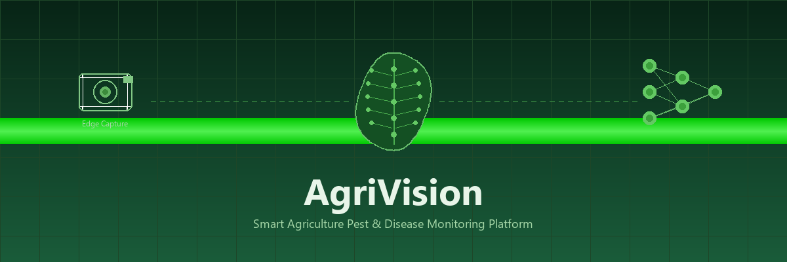
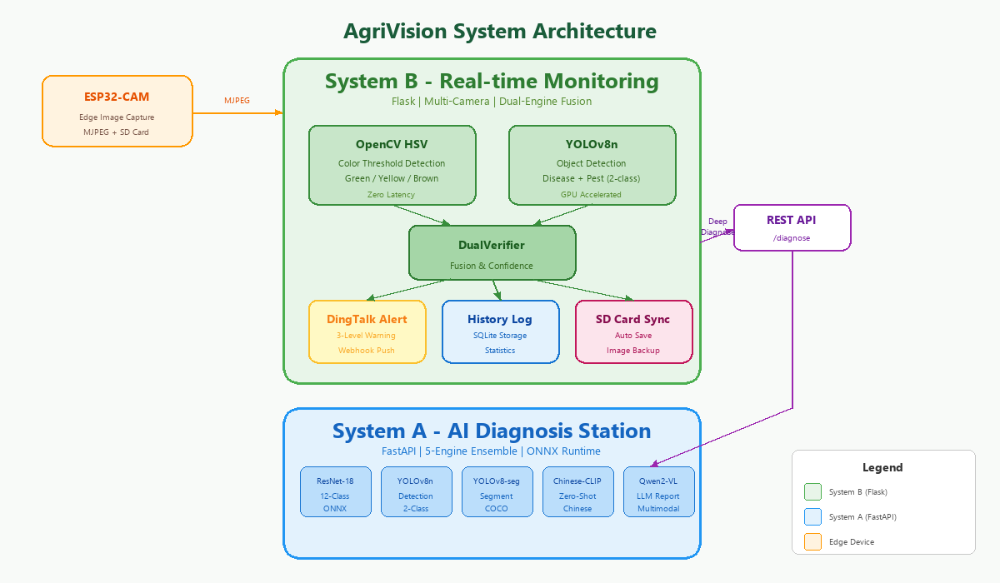

# AgriVision - 智慧农业病虫害监测与诊断平台

<p align="center">
  <strong>多引擎 AI 驱动 · 边缘-云端协同 · 实时预警</strong>
</p>

<p align="center">
  
  
  
  
</p>

---

<p align="center">
  
</p>

## 项目简介

AgriVision 是一个面向智慧农业场景的病虫害监测与诊断平台，集成了 **5 种 AI 推理引擎**、**双引擎实时检测**、**多摄像头监控**、**边缘设备固件** 和 **多级告警系统**，覆盖从田间图像采集到智能诊断报告的完整链路；同时提供默认关闭、可观测且具备本机可靠性回归的离线事件同步能力。

项目采用 **A-B 双系统架构**：

| 系统 | 定位 | 核心能力 |
|------|------|----------|
| **System A** | 智能诊断站 | ResNet-18 分类 · YOLOv8 检测 · CLIP 零样本 · Qwen2-VL 报告生成 |
| **System B** | 实时监控站 | OpenCV HSV 颜色检测 · YOLOv8 目标检测 · 双引擎融合验证 · 钉钉告警 |

两个系统通过 REST API 浅耦合——System B 的 Web 面板可一键调用 System A 生成深度诊断报告，也可独立运行。

## 系统架构

<p align="center">
  
</p>

### System A — 五引擎智能诊断站

```
用户上传图片 → FastAPI 路由 → 5 引擎并行推理 → 融合决策 → Qwen2-VL 生成报告
```

| 引擎 | 模型 | 功能 | 输入 |
|------|------|------|------|
| 1. ResNet-18 | best_model.onnx (ONNX Runtime) | 12 类病害分类 | 单张叶片图 |
| 2. YOLOv8n | best.pt | 病害+虫害 2 类目标检测 | 单张图 |
| 3. YOLOv8n-seg | yolov8n-seg.pt (COCO预训练) | 通用实例分割 | 单张图 |
| 4. Chinese-CLIP | OFA-Sys/chinese-clip-vit-base-patch16 | 零样本 12 类分类 | 图文匹配 |
| 5. Qwen2-VL-2B | Qwen/Qwen2-VL-2B-Instruct | 多模态 LLM 生成诊断报告 | 图片+提示词 |

**融合策略**：引擎 1/2/4 投票取最高票类别，置信度加权平均；引擎 3 提供分割掩码面积占比作为辅助参考。

### System B — 双引擎实时监控站

```
ESP32-CAM / IP摄像头 → MJPEG 流 → OpenCV HSV 检测 + YOLOv8 检测 → DualVerifier 融合 → 告警/日志
```

| 引擎 | 原理 | 优势 | 局限 |
|------|------|------|------|
| OpenCV HSV | 颜色空间阈值分割（绿/黄/棕斑） | 零延迟、无GPU需求 | 依赖光照、阈值敏感 |
| YOLOv8n | 深度学习目标检测 | 鲁棒性强、泛化好 | 需GPU、有推理延迟 |
| **DualVerifier** | 两引擎结果融合 | 降低误报、提高可信度 | — |

**告警链路**：检测异常 → 三级告警（通知/警告/严重）→ 钉钉 Webhook 推送 → 历史记录存储

### 浅耦合集成

System B 的 Web 监控面板提供"深度诊断"按钮，点击后将当前帧图片发送到 System A 的 `/diagnose` API，获取五引擎融合报告并展示。两个系统可独立部署、独立运行。

## 快速开始

### 环境要求

- Python 3.10+（推荐 3.11）
- CUDA 11.8+（GPU 推理可选，CPU 也可运行）
- ESP32-CAM 开发板（可选，用于边缘采集）

### 1. 克隆项目

```bash
git clone https://github.com/sun2006-xin/AgriVision.git
cd AgriVision
```

### 2. 安装依赖

```bash
# System A
pip install -r requirements-a.txt

# System B
pip install -r requirements-b.txt
```

### 3. 准备模型文件

将以下模型文件放入对应目录：

```
system_a/models/
├── best_model.onnx          # ResNet-18 导出的 ONNX 模型
└── hf_cache/                # Chinese-CLIP & Qwen2-VL (首次运行自动下载)

system_b/models/
├── best.pt                  # System B YOLOv8 病害/虫害检测模型
└── yolov8n-seg.pt           # YOLOv8n-seg 分割模型 (COCO预训练)
```

> **提示**：ResNet-18 模型可通过 `system_a/core/train_classifier.py` 自行训练，或使用 `convert_to_onnx.py` 从 `.pth` 导出 ONNX。

### 4. 启动服务

```bash
# 方式一：一键启动全部（Windows）
start_all.bat

# 方式二：分别启动
start_a.bat    # System A → http://127.0.0.1:8000
start_b.bat    # System B → http://127.0.0.1:5000

# 方式三：手动命令
# System A
cd system_a/core
python -m uvicorn app_fastapi:app --host 0.0.0.0 --port 8000

# System B
cd system_b/core
python app.py
```

### 5. 访问

| 服务 | 地址 | 说明 |
|------|------|------|
| System A 前端 | http://127.0.0.1:8000 | 五引擎诊断站（根路由直接返回 frontend.html） |
| System A API 文档 | http://127.0.0.1:8000/docs | FastAPI 自动生成的 Swagger UI |
| System B 监控面板 | http://127.0.0.1:5000 | 双引擎实时监控 |

## 项目结构

```
AgriVision/
├── system_a/                    # System A: FastAPI 五引擎诊断站
│   ├── core/
│   │   ├── app_fastapi.py       # FastAPI 主服务 (5引擎路由+融合)
│   │   ├── frontend.html        # 单文件前端 SPA
│   │   ├── database.py          # SQLite 数据层 (历史/缓存/异步任务)
│   │   ├── train_classifier.py  # ResNet-18 训练脚本 (12类)
│   │   ├── convert_to_onnx.py   # PyTorch → ONNX 导出工具
│   │   ├── deploy_ai.py         # [遗留代码] 早期3类推理工具
│   │   └── data.yaml            # YOLO 数据集配置
│   ├── models/                  # 模型文件 (.onnx/.pth, git忽略)
│   ├── .venv/                   # Python 虚拟环境 (git忽略)
│   └── start.bat                # 快捷启动脚本
│
├── system_b/                    # System B: Flask 双引擎实时监控
│   ├── core/
│   │   ├── app.py               # Flask 主服务 (多摄像头+检测+告警)
│   │   ├── detection_enhanced.py # OpenCV HSV 颜色检测引擎
│   │   ├── yolo_detector.py     # YOLOv8 目标检测引擎
│   │   ├── dual_verifier.py     # 双引擎融合验证器
│   │   ├── alert_notifier.py    # 钉钉 Webhook 告警
│   │   ├── history.py           # 检测历史与统计
│   │   ├── config.py            # 配置管理
│   │   └── config/              # JSON 配置文件
│   ├── firmware/                # ESP32-CAM Arduino 固件
│   └── models/                  # 模型文件 (.pt, git忽略)
│
├── docs/                        # 项目文档
│   ├── tech-doc.md              # 总体技术文档 (快速入门+架构+部署)
│   ├── system-a-guide.md        # System A 详细指南
│   ├── system-b-guide.md        # System B 详细指南
│   └── images/                  # 文档图片
│
├── cameras.json                 # 摄像头配置文件
├── start_all.bat                # 一键启动 A+B
├── start_a.bat                  # 仅启动 A
├── start_b.bat                  # 仅启动 B
├── requirements-a.txt           # System A 依赖
├── requirements-b.txt           # System B 依赖
├── LICENSE                      # Apache License 2.0
└── .gitignore
```

## 技术栈

| 层级 | 技术 |
|------|------|
| **后端框架** | FastAPI (System A) · Flask (System B) |
| **AI 推理** | ONNX Runtime · PyTorch · Ultralytics YOLOv8 · Transformers · Chinese-CLIP · Qwen2-VL |
| **图像处理** | OpenCV · Pillow |
| **前端** | 原生 HTML/CSS/JS 单文件 SPA (无框架依赖) |
| **数据存储** | SQLite (诊断历史 · 结果缓存 · 异步任务) |
| **告警通知** | 钉钉 Webhook (三级告警: 通知/警告/严重) |
| **边缘设备** | ESP32-CAM (Arduino · MJPEG · SD卡自动存储) |
| **通信协议** | HTTP REST · MQTT (巴法云, ESP8266 环境控制) |

## 详细文档

| 文档 | 内容 |
|------|------|
| [总体技术文档](docs/tech-doc.md) | 架构概览、快速启动、服务器部署指引 |
| [System A 指南](docs/system-a-guide.md) | 五引擎详解、API 文档、模型训练、Nginx 部署 |
| [System B 指南](docs/system-b-guide.md) | 双引擎架构、多摄像头配置、告警系统、ESP32 固件 |
| [技术路线图](docs/roadmap.md) | 阶段目标、验收标准与后续迭代方向 |

## 当前版本说明

阶段 1 已完成基础可用性收敛，阶段 2 已完成工程化基础，阶段 3 已完成评估基础，阶段 4/5/6/7/8/9/10/11/12/13/14/15/16/17/18/19/20/21/22/23/24/25/26/27/28/29/30/31/32 已完成边缘离线队列、可靠 HTTP 同步、本地端到端、本机 HTTP 回环、开源发布 CI 门禁、CI 云端证据、MQTT 传输契约、连接安全边界、可选 Paho 运行时、Paho 云端回归、本机 MQTT 协议验收、System B MQTT 手动同步接入、初始连接重试、运行中断线重连、默认关闭的自动同步、同步状态可观测性、同主机跨进程互斥、HTTP 错误分类重试、本机 TLS 证书验收、本机 TLS 认证验收、全连接 CONNACK 验收、失败连接重试生命周期验收、CONNACK 等待边界验收、发布确认等待边界验收、关闭生命周期验收、发布状态异常重试、MQTT 配置状态可观测性和事件同步状态面板验收基础：修复 A/B 接口契约，增加参数校验、健康探针、请求观测、原子配置写入、固定 JSON 预测集评估、低置信度标记、有界检测事件缓存、幂等键、并发防护、响应丢失重试验证、真实本机 HTTP/MQTT 请求验证、成功后确认的手动同步入口、跟踪文件隐私扫描、注入式 MQTT 发布契约、远端 TLS 约束、可关闭的 Paho 生命周期、显式 MQTT 手动同步路由、有界初始连接重试、运行中断线恢复验证、可控后台调度、脱敏状态接口、同主机多进程锁、4xx/5xx 分类处理、临时 CA 证书回归、MQTT v5 认证失败处理、无认证失败 CONNACK 拒绝、失败重试资源清理、可配置有界的 CONNACK 等待、可配置有界的发布确认等待、幂等安全关闭、Paho 发布状态异常有界重试、仅暴露超时数值的状态诊断和前端安全展示。模型权重默认保留在本地，不随 Git 仓库分发；首次使用前请按文档准备模型文件。

阶段 33 进一步隔离事件同步状态刷新故障：状态接口暂时不可用时，实时检测页面仍保持刷新，并仅显示固定的脱敏提示。

阶段 34 已增加可选 Chromium smoke 测试入口，验证实时监控页在事件状态接口失败时仍可加载；浏览器测试依赖不会进入生产安装路径。

阶段 35 已将 Chromium smoke 接入 GitHub Actions 独立质量门禁，自动检查实时监控页的状态故障隔离；生产安装路径仍不包含 UI 测试依赖。

阶段 36 已增加浏览器控制台错误回归，确保事件同步状态故障不会演变为实时监控页面的未处理前端错误。

阶段 37 已加入 MQTT 部署前安全预检，实时面板可显示配置是否就绪和 TLS 模式，但不会显示 broker 地址或任何凭据。

阶段 38 已补齐 MQTT 运行时状态闭环：实时面板可区分未配置、连接中、已连接、连接失败和发布失败；状态信息保持脱敏，发布失败仍采用有界重试且不会提前确认离线事件。

阶段 39 已修正 MQTT 手动同步的空队列统计：没有待发送事件时不会虚增成功批次，也不会进行无意义的发布尝试。

阶段 40 已将同步请求校验前置到 MQTT 连接之前，非法 JSON 或 `limit` 不会触发网络连接、重试或凭据使用。

阶段 41 已为离线事件缓存增加单条大小保护，超限事件会在写入前被拒绝，避免边界情况下静默丢失已有事件。

公开发布门禁已在 GitHub Actions 对提交 `1c68338` 验证通过：[查看 CI 运行记录](https://github.com/sun2006-xin/AgriVision/actions/runs/34762246684)。

MQTT 契约测试也已在 GitHub Actions 对提交 `de89384` 验证通过：[查看 MQTT CI 运行记录](https://github.com/sun2006-xin/AgriVision/actions/runs/34762437681)。这不代表真实 broker 或 ESP32 已完成联调。

可选 Paho 运行时也已在 GitHub Actions 对提交 `4f33688` 验证通过：[查看 Paho CI 运行记录](https://github.com/sun2006-xin/AgriVision/actions/runs/34762728744)。真实 broker、TLS 证书和设备链路仍需现场验收。

System A 默认只允许本机 A/B 前端来源访问。如需部署到其他域名，请显式设置 `CORS_ORIGINS`，使用逗号分隔的来源列表，不建议使用 `*`。

System B 的离线事件自动同步默认关闭；配置 `AGRIVISION_EVENTS_SYNC_INTERVAL`（秒，正数启用）后才会周期性发送，`AGRIVISION_EVENTS_SYNC_LIMIT` 可设置每批 1–100 条。自动同步优先使用 MQTT，否则使用 `AGRIVISION_EVENTS_SINK_URL` 指定的 HTTP sink；手动和自动同步通过同一主机的 SQLite 运行时锁避免多进程重复消费，可通过 `/api/offline_events/sync_status` 查看脱敏的运行状态、队列数量和成功/失败计数。真实生产 TLS、认证、跨主机协调和设备断网恢复仍需现场验收。

HTTP sink 的 4xx 会被标记为永久失败并停止重试；5xx 或网络异常才进入有界重试。状态接口只显示固定失败类别，不显示响应正文或异常详情。

本机 MQTT TLS 回归使用临时证书和回环 broker，不代表公网证书链、认证、ACL 或 ESP32 链路已完成验收。

本机 MQTT 认证回归同时验证独立 username/password 注入和错误凭据拒绝；公网认证、ACL、证书轮换和 ESP32 链路仍需现场验收。

本机 MQTT 连接回归还验证所有真实 Paho 连接都会检查 MQTT v5 CONNACK；无认证连接收到失败响应时会在发布前被拒绝。该结果不等价于公网 broker、ACL 或 ESP32 现场验收。

初始连接失败重试会清理旧网络循环并创建新的 Paho client，避免连接失败后的线程和 socket 状态泄漏；该验证仍属于本机软件回归，不代表公网长时间故障或设备现场验收。

CONNACK 等待默认 5 秒，可通过 System B 环境变量 `AGRIVISION_MQTT_CONNACK_TIMEOUT` 在 0.1–30 秒范围内调整；该配置仅控制握手等待，不会放宽发布重试或隐私边界。

MQTT QoS 1 发布确认默认等待 10 秒，可通过 `AGRIVISION_MQTT_PUBLISH_TIMEOUT` 在 0.1–60 秒范围内调整；超时不会确认本地事件，也不会把凭据或 broker 地址写入日志。

同步状态接口在 MQTT 启用时显示当前生效的握手与发布确认超时（仅数值，未启用时为 `null`），不显示 broker 或凭据。

实时监控页同步展示脱敏的事件同步摘要，包括传输类型、待发送数量、成功/失败批次数和超时数值，便于现场快速判断队列是否积压。

MQTT 关闭回调支持重复调用且会吞掉断开异常、继续停止网络 loop，适合手动同步和进程退出路径；该行为已用本机 fake client 回归验证。

## 服务器部署

简要步骤（详见 [总体技术文档 - 服务器部署](docs/tech-doc.md#6-服务器部署概览)）：

1. **System A**：安装 Python + CUDA + 模型文件 → `uvicorn app_fastapi:app` → Nginx 反向代理 → 配置 HTTPS
2. **System B**：安装 Python + 模型文件 → `python app.py` → Nginx 反向代理 → 配置摄像头地址
3. **ESP32-CAM**：Arduino IDE 编译固件 → 修改 `config.h` 中的 WiFi 和服务器地址

> 中国网络环境注意：HuggingFace 模型下载需配置镜像源（`HF_ENDPOINT=https://hf-mirror.com`），pip 安装建议使用清华源。

## 贡献

欢迎 Issue 和 Pull Request！

## 许可证

本项目基于 [Apache License 2.0](LICENSE) 开源。衍生作品需保留 NOTICE 文件中的创始人声明。详见 [NOTICE](NOTICE)。

## 致谢

- [Ultralytics YOLOv8](https://github.com/ultralytics/ultralytics) — 目标检测与分割
- [Chinese-CLIP](https://github.com/OFA-Sys/Chinese-CLIP) — 中文图文对比学习
- [Qwen2-VL](https://github.com/QwenLM/Qwen2-VL) — 多模态大语言模型
- [ONNX Runtime](https://github.com/microsoft/onnxruntime) — 跨平台推理加速
- [PlantDoc Dataset](https://github.com/prakhar21/PlantDoc-Dataset) — 植物病害图像数据集
